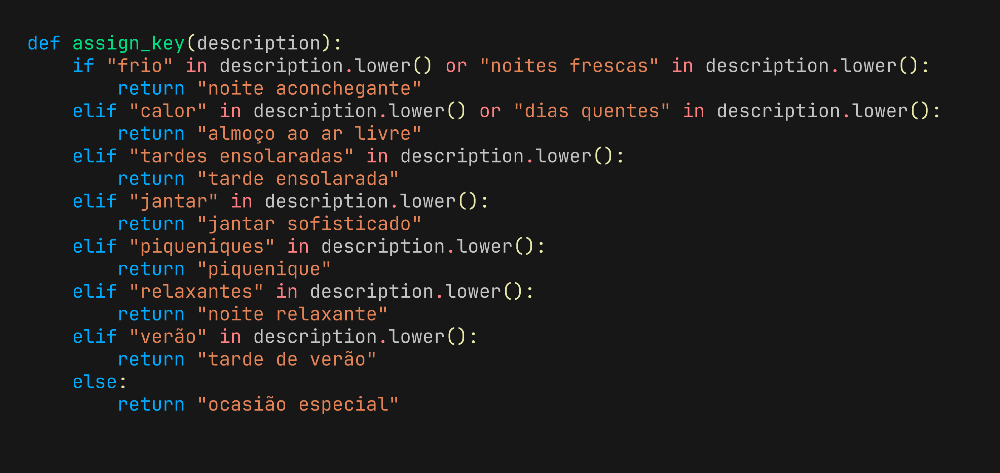
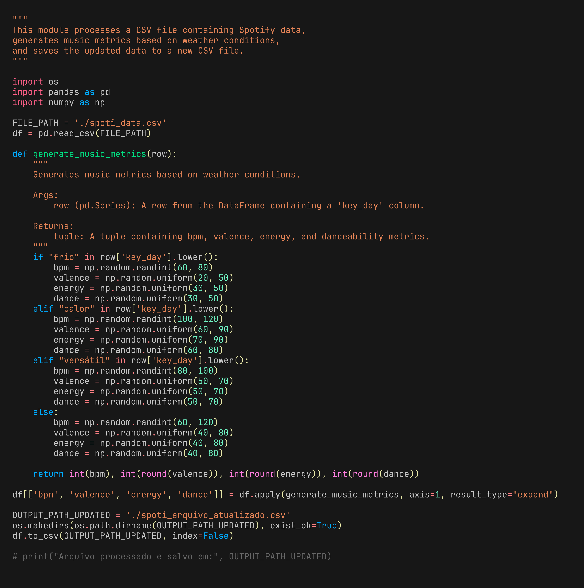
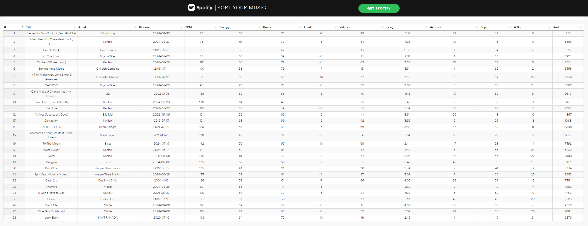
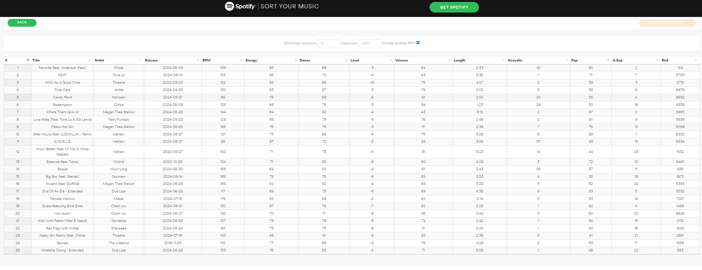
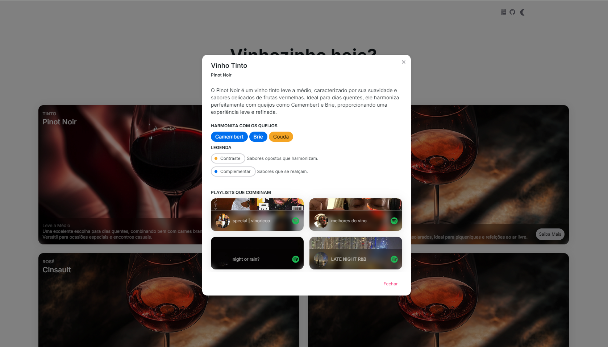

## Spotify map via vinoricco :ghost:

O objetivo desta documentação é fornecer um guia detalhado para a construção de playlists específicas no aplicativo Vinoricco, levando em consideração as características musicais ideais para diferentes ocasiões. A função assign_key(description) mapeia descrições de ambientes para diferentes tipos de playlists, que precisam ser ajustadas com base em variáveis musicais, como bpm, valence, energy, danceability e loudness. Essa função foi construída em uma média de palavras utilizadas para descrever a situação que cada vinho se encaixa melhor.

### 1. Outside

-   **Bpm**: 80-130/140
-   **Valence**: 0.5 - 0.8
-   **Energy**: 0.6 - 0.9
-   **Danceability**: 0.5 - 0.8
-   **Loudness**: -6 ~ 0 dB
-   **Variáveis de Referência**: **Valence** e **Energy**
-   **Descrição**: A playlist "Outside" é ideal para atividades ao ar livre. Os valores de `Valence` e `Energy` asseguram que a música seja vibrante e energizante, perfeita para motivar e elevar o ambiente em espaços abertos.

### 2. Special

-   **Bpm**: 60-130
-   **Valence**: 0.4 - 0.7
-   **Energy**: 0.4 - 0.9
-   **Danceability**: 0.4 - 0.8
-   **Loudness**: -8 ~ -4 dB
-   **Variáveis de Referência**: **Energy** e **Danceability**
-   **Descrição**: "Special" é uma playlist destinada a ocasiões especiais. Para isso, a `Energy` e a `Danceability` são fundamentais para garantir uma vibração positiva e animada, adequada para celebrações e momentos marcantes.

### 3. Sofisticado

-   **Bpm**: 50-90
-   **Valence**: 0.3 - 0.5
-   **Energy**: 0.3 - 0.6
-   **Loudness**: -10 ~ -6 dB
-   **Variáveis de Referência**: **Bpm** e **Loudness**
-   **Descrição**: A playlist "Sofisticado" deve refletir uma atmosfera elegante e refinada. O ritmo (`Bpm`) e a presença sonora (`Loudness`) são essenciais para criar uma experiência sonora que seja simultaneamente calma e sofisticada.

### 4. Aconchego

-   **Bpm**: 50-80
-   **Valence**: 0.2 - 0.4
-   **Energy**: 0.2 - 0.5
-   **Danceability**: 0.3 - 0.5
-   **Loudness**: -12 ~ -8 dB
-   **Variáveis de Referência**: **Valence** e **Energy**
-   **Descrição**: A playlist "Aconchego" foca na criação de um ambiente emocionalmente reconfortante e acolhedor. Os valores de `Valence` e `Energy` são cruciais para manter o clima de tranquilidade e suavidade.

## Resumo das Relações

Cada playlist foi projetada com variáveis específicas para atender ao contexto em que será utilizada. A tabela abaixo resume as variáveis-chave para cada playlist:

| Playlist    | Variáveis Principais          | Descrição                                                 |
| ----------- | ----------------------------- | --------------------------------------------------------- |
| Outside     | **+Valence** e **+Energy**    | Música vibrante e energizante para atividades ao ar livre |
| Special     | **Energy** e **Danceability** | Ocasiões especiais e intensas                             |
| Sofisticado | **Bpm** e **Loudness**        | Atmosfera elegante e refinada, ideal para jantares        |
| Aconchego   | **-Valence** e **-Energy**    | Criação de um ambiente emocionalmente reconfortante       |

### Playlists

Utilizei o `SORT YOUR MUSIC` para categorizar e organizar as playlists de acordo com suas categorias. Algumas músicas se compensam, assim como quando algo sobe, outra desce. Assim como também há músicas que se complementam e não andam sozinhas. Esse é um caso de transições bem executadas. Cada uma, entretanto, possui características como aumento de energia e/ ou valence.

### special | vinoricco

### outside | vinoricco

## Spotify

### Curadoria de Playlists

O processo de curadoria no Vinoricco foca em combinar as playlists mais adequadas com os vinhos recomendados, levando em consideração o clima e as características dos vinhos. As playlists são classificadas e priorizadas com base em critérios específicos:

##### Playlists Proprietárias:

Playlists que contêm "vinoricco" no nome são priorizadas e exibidas primeiro. Essas playlists são criadas especificamente para a plataforma, garantindo uma experiência personalizada e exclusiva.

##### Playlists Randômicas:

Após as playlists proprietárias, as playlists restantes são selecionadas de forma randômica para adicionar diversidade e variedade às recomendações musicais.

##### Construção das Queries

As queries para buscar playlists são construídas com base em duas listas de chaves associadas a cada vinho:

A chave que contém "vinoricco" é sempre destacada para aparecer em primeiro lugar.

Chaves adicionais que são aleatorizadas de acordo com o vinho para adicionar diversidade. A ordem dessas chaves é randomizada a cada requisição, garantindo que diferentes playlists sejam exibidas cada vez que o modal é aberto.

### Finals

A curadoria no Vinoricco não apenas busca alinhar a música com a experiência de consumo de vinho, mas também oferece um toque personalizado através de playlists proprietárias. O uso de queries bem estruturadas e um algoritmo eficiente garantem que as melhores opções sejam sempre apresentadas ao usuário e está sendo aprimorado.

A capacidade de randomização e priorização integrada ao sistema permite uma experiência dinâmica e sempre fresca, mantendo o equilíbrio entre consistência e variedade nas recomendações.
